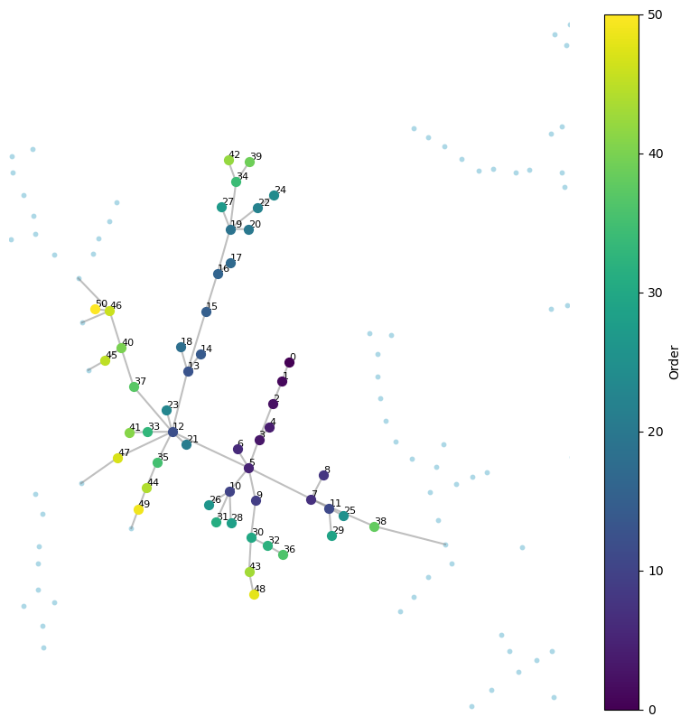
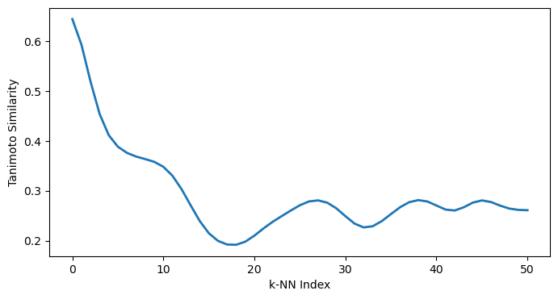

# TMAP Analysis and Visualization

This repository contains the python scripts associated to the study "*A chemical space model for the exploration of eco-toxicological data*" (Lopez-Rodriguez et al., 2025 BioRXiv). Using a predefined TMAP layout (Reymond & Probst, 2020), the functions in this repository allow users to:

- Retrieve and visualize the k-nearest neighbors (k-NN) in the chemical space.
- Compute and visualize the Tanimoto similarity decay among k-NN.
- Perform data imputation based on the TMAP layout.

Additional functions are provided to visualize and explore the results.


# Dependencies

The notebook relies mainly on the following Python (3.7.6) libraries:

- numpy
- pandas
- networkx
- rdkit
- scipy
- matplotlib
- pickle
- multiprocessing
- functools

All dependencies are included in environment.yml.


# Data Inputs

- x,y,s,t: TMAP node coordinates and edge lists 
- morgan_fps.pkl: precomputed Morgan fingerprints
- table_cat.csv: Categorical metadata for molecules.
- table_num.pkl: Numerical feature matrix


#  Functions Overview

The repository provides the following key functions:

#### Graph & Neighbors

- *get_closest_connected_nodes(index, x, y, G, k=50)*
Computes the k-nearest connected neighbors for a node in the graph using a distance-based BFS.

- *plot_knn(neighbors, x, y, s, t, distance=0.01)*
Visualizes the selected kNN nodes the TMAP layout, with a color gradient indicating neighbor order.

#### Molecular Similarity

- *k_similarity_matrix(neighbors, morgan)*
Computes the Tanimoto similarity matrix for the selected neighbors using Morgan fingerprints.

- *decay_curve(sim_matrix, sigma=2)*
Plots a smoothed decay curve of molecular similarity along the kNN index.

#### Data Imputation

- *process_row(row_data, G, depth)*
Performs BFS-based propagation of feature values across a subgraph.

- *calculate_imputed_values(depth, index, table_num, features, s, t)*:
Uses parallel processing to compute imputed feature values for all nodes in the graph.

- *plot_imputed_values(imputed_data, table_cat, x, y, s, t, feature)*
Visualizes imputed feature values on the graph with a custom colormap.


# Workflow

The workflow can be found in the jupyter notebook. 

#### Import Libraries

```
import heapq
import networkx as nx
import pandas as pd
import os
from matplotlib import pyplot as plt
import pickle
import numpy as np
from rdkit.Chem import DataStructs
from scipy.ndimage import gaussian_filter1d
from scipy.sparse import csc_matrix
import multiprocessing as mp
from functools import partial
from matplotlib.colors import LinearSegmentedColormap
```

#### Data Loading

```
folder_path = 'Data/'        
x = pd.read_csv(os.path.join(folder_path, 'x.csv')).values.flatten()  
y = pd.read_csv(os.path.join(folder_path, 'y.csv')).values.flatten()   
s = pd.read_csv(os.path.join(folder_path, 's.csv')).values.flatten()  
t = pd.read_csv(os.path.join(folder_path, 't.csv')).values.flatten()   
with open("Data/morgan_fps.pkl", "rb") as f:
    morgan = pickle.load(f)

table_cat = pd.read_csv('Data/table_cat.csv',index_col=0, encoding='utf-8')

with open("Data/table_num.pkl", "rb") as f:
    obj = pickle.load(f)

table_num = obj["matrix"]
colnames = obj["colnames"]
rownames = obj["rownames"]
```
Morgan fingerprints, metadata and the database are publicly available in Zenodo, refer to the publication for details. 

#### index k-NN TMAP computation 

```
# SET PARAMS
index = 20
k = 50

# FIND AND PLOT THE kNNs
G = nx.Graph()
G.add_edges_from(zip(s, t))
neighbors = get_closest_connected_nodes(index, x, y, G, k)
plot_knn(neighbors, x, y, s, t, distance=0.01)
```

Using a defined node index in the TMAP layout, *get_closest_connected_nodes()* computes the k nearest neighbors using an existing TMAP layout. 

*plot_knn()* allows to obtain a visual representation of the output:

<p align="center">
  
</p>

#### k-NN Molecular Similarity & Decay Curve 

```
# COMPUTE SIMILARITY MATRIX AND PRODUCE DECAY CURVE
sim_matrix = k_similarity_matrix(neighbors, morgan)
decay_curve(sim_matrix, sigma=2)
```

Compute similarity matrix for neighbors using k_similarity_matrix and plotting a smoothed decay curve.

<p align="center">
  
</p>


#### Feature Imputation

```
feature = 'HTGene_ESR1'
feature_index =  colnames.index(feature)
imputed_data = calculate_imputed_values(depth=50, index=feature_index, table_num=table_num, features=rownames, s=s, t=t)
plot_imputed_values(imputed_data,table_cat,x,y,s,t,feature)
```

By selecting a specific feature from the database, *calculate_imputed_values()* provides a vector with data imputed. The function conserves the original experimental data and use multiprocessing. *plot_imputed_values()* provides a visualization in the TMAP layout. 

## Suggestions and contributions 
Please use github issue tracker to report coding related issues or contact me directly at dalodriguez@gmail.com

## How to cite?
Lopez-Rodriguez D, Guerrero Limon G & Chèvre N. A chemical space model for the exploration of eco-toxicological data. bioRxiv 2025.09.18.677052; doi: https://doi.org/10.1101/2025.09.18.677052
